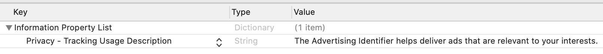
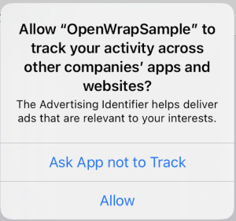

# React Native Implementation

## Required dependencies for mobile


| | |
|---|---|
| **DEVELOPMENT ENVIRONMENT** | React Native v0.66.0 onwards |
| **TARGET ENVIRONMENT** | Android version 5.0 (API level 21) - Android version 13 (API level 33).<br>iOS version 11.0 - 17.0. |
| **PUBLISHER/PLACEMENT DETAILS** | Before starting OpenWrap SDK integration with supported ads in your app, you must have the following details:<br>- Publisher ID<br>- OpenWrap Profile ID<br>- OpenWrap Ad Unit Id<br><br>You can use PubMatic test profiles to test during SDK integration.<br><br>**OR**<br><br>You can create an OpenWrap Profile using your account. To learn more about OpenWrap profile creation and management, see [OpenWrap Mobile In-App Support](/openwrap/docs/openwrap-mobile-in-app-support).<br><br>Questions?<br>Contact your PubMatic Account Manager. |


### Add the OpenWrap SDK React Native plugin
You can download and integrate the OpenWrap SDK React Native module using npm, as shown below.

```ssh
npm install react-native-openwrap-sdk
```
## Platform-specific configurations

### Android

#### Add permissions to AndroidManifest.xml file
Now that you've satisfied the required dependencies, it's time to update permissions in your `AndroidManifest.xml`  file.
Android OpenWrap SDK requires only two mandatory permissions:

| PERMISSION | DESCRIPTION | MANDATORY |
|------------|-------------|-----------|
| Internet | Required to access the Internet for ad-content download. | Yes |
| Network State | Required to access the network for setting ad request parameters. | Yes |
| Fine Location | Required if you want the SDK to fetch the device's precise location.<br>If your app targets Android 12 and you request the `ACCESS_FINE_LOCATION` permission, you must also request the `ACCESS_COARSE_LOCATION` permission. You must include both permissions in a single runtime request. If you try to request only `ACCESS_FINE_LOCATION`, the system ignores the request and logs this error message in LogCat:<br><br>`ACCESS_FINE_LOCATION` must be requested with `ACCESS_COARSE_LOCATION`.<br><br>For more information, see Android's [User can grant only approximate location](https://developer.android.com/training/location/permissions#approximate-request). | No |
| External Storage | Required to access SD card photo and file storage to support MRAID features. | No |
| Coarse Location | If your app targets Android 12 and you request the `ACCESS_FINE_LOCATION` permission, you must also request the `ACCESS_COARSE_LOCATION` permission. You must include both permissions in a single runtime request. If you try to request only ACCESS_FINE_LOCATION, the system ignores the request and logs the following error message in LogCat:<br><br>`ACCESS_FINE_LOCATION` must be requested with `ACCESS_COARSE_LOCATION`.<br><br>See [User can grant only approximate location](https://developer.android.com/training/location/permissions#approximate-request). | No |
| Read Phone State | API level 30 onwards requires the cellular connection type (such as 3G and 4G). Without this permission, the ad request parameter `device.connectiontype` is sent as 3 (such as `Cellular Network – Unknown`). | No |

The following code snippet adds necessary permissions to your app's AndroidManifest.xml file:
```xml
<manifest>
    <!--
     Mandatory permission for OpenWrap SDK
    -->
    <uses-permission android:name="android.permission.INTERNET"/>
    <uses-permission
android:name="android.permission.ACCESS_NETWORK_STATE"/>
    <!--
      Optional permission for OpenWrap SDK
    -->
    <uses-permission
android:name="android.permission.ACCESS_FINE_LOCATION"/>
    <uses-permission
android:name="android.permission.ACCESS_COARSE_LOCATION"/>
    <uses-permission
android:name="android.permission.WRITE_EXTERNAL_STORAGE"/>
    <!--
      Ask this permission to user (at runtime from code) only for API 30+
    -->
    <uses-permission
android:name="android.permission.READ_PHONE_STATE"/>
</manifest>
```
### Network security configuration
OpenWrap SDK defaults to secure ad calls and delivers
only secure ads. When configuring OpenWrap SDK to serve non-secure ads,
opt out of cleartext traffic because Android 9.0 (API 28)
blocks cleartext (non-HTTPS) traffic by default ,
preventing ads from rendering. To resolve this in apps on Android 9.0
or greater, including a network security config file that allowlists
cleartext traffic allows HTTP ads to render.

1. Create the `Plugins/res/xml/network_security_config.xml` resource file in your app, then add the following XML:

```xml
<?xml version="1.0" encoding="utf-8"?>
 <network-security-config>
    <base-config cleartextTrafficPermitted="true">
        <trust-anchors>
            <certificates src="system"/>
        </trust-anchors>
    </base-config>    
</network-security-config>
```
2. Update the `<application>` tag of your app's `AndroidManifest.xml` file to match the following example:

```xml
<manifest>
    <application
       android:networkSecurityConfig="@xml/network_security_config">
    </application>
</manifest>
```

## IOS

### iOS 14 integration
iOS 14 brings several changes to enhance the ad experience for mobile users.
See the following section to request App Tracking Transparency (ATT)
authorization and to configure SKAdNetwork in your app.


### Request App Tracking Transparency (ATT) authorization

To display the App Tracking Transparency authorization request to access the IDFA, update your Info.plist  to add the  NSUserTrackingUsageDescription  key with a custom message describing your intended IDFA usage. For example:

Privacy - Tracking Usage Description

```xml
<key>NSUserTrackingUsageDescription</key>
<string>The Advertising Identifier helps deliver ads that are relevant to your interests.</string>
```

#### Xcode setting:



Users see the usage description in the App Tracking Transparency dialog box:



To present the authorization request, call requestTrackingAuthorizationWithCompletionHandler:. The best practice is to wait for the completion callback before loading ads so that if the user grants the ATT permission, the ad server SDK can immediately use the IDFA in ad requests.

### Objective-C

```ssh
#import <AppTrackingTransparency/AppTrackingTransparency.h>
#import <AdSupport/AdSupport.h>
 
if(@available(iOS 14, *)) {
    [ATTrackingManager requestTrackingAuthorizationWithCompletionHandler:^(ATTrackingManagerAuthorizationStatus status) {
        // Use trackingAuthorizationStatus to determine the app-tracking permission status.
        // See ATTrackingManager.AuthorizationStatus for status enums.
    }];
}
```

### Swift

```ssh
import AppTrackingTransparency
import AdSupport
 
if #available(iOS 14, *) {
    ATTrackingManager.requestTrackingAuthorization { (status: ATTrackingManager.AuthorizationStatus) in
        // Use trackingAuthorizationStatus to determine the app-tracking permission status.
        // See ATTrackingManager.AuthorizationStatus for status enums.
    }
}
```

For more information about the possible status values, see,
ATTrackingManager.AuthorizationStatus.

> 👍 **Best practices**
>
> - Add a priming message preceding the call to `RequestAuthorizationTracking` to better explain the permission and data usage to users.
> - Request the ad only after the post-authorization callback. This lets OpenWrap SDK immediately access and pass the IDFA in the ad request if the user approves the IDFA access request.


### Configure SKAdNetwork settings to track conversions
OpenWrap SDK is compatible with iOS 14 and supports Apple's
SKAdNetwork starting from v2.0, allowing mobile apps to install
attribution for demand partners buying in-app inventory from iOS 14 while
preserving user privacy.

To enable install attribution, you must update the SKAdNetworkItems
key with additional network ID dictionary entries in your app's Info.plist.

> 📘 **Get the latest SKAdNetwork ad network IDs**
>
> Use the links below for the up-to-date SKAdNetwork list:
>
> - [https://pubmatic.com/skadnetworkids.json](https://pubmatic.com/skadnetworkids.json)
> - [https://pubmatic.com/skadnetworkids.xml](https://pubmatic.com/skadnetworkids.xml)

#### Include ad network IDs in your [information property list](https://developer.apple.com/library/archive/documentation/General/Reference/InfoPlistKeyReference/Articles/AboutInformationPropertyListFiles.html):

1. Select `Info.plist` in the Xcode Project navigator.

2. Click the **Add** button (+) beside a key in the property list editor, then press **Return**.

3. Type the key name, `[SKAdNetworkItems](https://developer.apple.com/documentation/bundleresources/information_property_list/skadnetworkitems)`.

4. Choose **Array** from the pop-up menu in the **Type** column, then enter the dictionary entries as shown below.


> ❗️ If the user taps an ad that attempts an API call for an ad network missing from the `Info.plist`, the system won't initiate install validation. Also, note that missing this step can negatively affect the fill rate. Therefore, the SDK plugin takes care of this step by default.


> 📘 See [iOS SKAdNetwork support](/openwrap/docs/ios-skadnetwork-support).


## Show banner ads

Banner ads are the most commonly used ad format in mobile apps. Banner ads usually appear as a short strip spanning the app page or screen, positioned above or below the app content. Banners typically stay on screen and visible as the user interacts with app content.

Banner ads can deliver:
- **Display creatives** - images (still or animated), HTML5, rich media (MRAID 2.0 or 3.0), text along with a hyperlink that redirects to the respective product web site or app store.
- **Video creatives (300x250)** - popularly known as in-banner video. OpenWrap SDK supports in-banner video ads for 300x250 size only.

In an app environment, banner ads periodically refresh after a given time interval.

The most commonly used sizes for Banner ads on mobile phones are:
- 320x50
- 468x60

On tablets, they are typically:
- 728x90
- 300x250
- and so on

Before you begin, you'll need the following IDs:

- Publisher ID
- Profile ID
- OpenWrap ad unit ID

For details, go to the required dependencies. You can also use PubMatic's test profile/placements to verify your integration.

### Mandatory global configuration
App inventory transparency is very important to buyers.
You must set the Google Play storeURL or App Store storeURL of your app before you request an ad using OpenWrap SDK.
This should be the URL where users can download your app from the Play Store or App Store. Set the storeURL as shown
in the code samples below.
Once set, it is globally available in your app; you don't need to set it for every ad request (of any ad type).

```typescript

// Import required OpenWrap SDK plugin.
import { OpenWrapSDK, POBApplicationInfo } from "react-native-openwrap-sdk";
 
const applicationInfo = new POBApplicationInfo();
 
if (Platform.OS === "android") {
    // A valid Play Store Url of an Android application is required
    applicationInfo.storeUrl = new URL(
        "<#YourPlayStoreURL#>"
      );
} else if (Platform.OS === "ios") {
    // Set a valid App Store URL, containing the app id of your iOS app.
    applicationInfo.storeUrl = new URL(
        "<#YourAppStoreURL#>"
      );
}
 
// This app information is a global configuration.
// You need not set this for every ad request(of any ad type).
OpenWrapSDK.setApplicationInfo(applicationInfo);
```

### Create POBBannerView

Follow these steps to integrate banner ads with your app:

1. Add `POBBannerView` component by providing the publisher ID, profile ID, OpenWrap ad unit ID and ad sizes in `POBAdUnitDetails` as a `prop`.
2. Add component in react view hierarchy it will automatically loads the ad.

Your code should look similar to the sample below.

```typescript
import React, { useEffect, useState } from "react";
import { View } from "react-native";
import {
  POBAdSize,
  POBAdUnitDetails,
  POBBannerView
} from "react-native-openwrap-sdk";
 
//------------------------------------------------------------------------------
// The code below includes placeholders indicated in angle brackets, such as <PUB_ID>.
// Replace these placeholders with values from your PubMatic account.
// If you are doing initial testing, you can use PubMatic test IDs.
//
// For test id check the test section 
// CAUTION: BE SURE TO REPLACE ANY TEST VALUES WITH THE ACTUAL PRODUCTION IDS
// FOR YOUR ACCOUNT BEFORE GOING LIVE
//------------------------------------------------------------------------------
 
const App = () => {
 
  let adUnitDetails : POBAdUnitDetails = {
    publisherId: "<PUB_ID>",
    profileId: <PROFILE_ID>,
    adUnitId: "<AD_UNIT_ID>",
    adSizes: [<POBAdSize>]
  };
 
 
  return (
    <View>
       <POBBannerView
            adUnitDetails={adUnitDetails}
        />
    </View>
  );
};
 
export default App;
```

### Optional events

Your app can also listen to additional banner ad events (such as onAdReceived, onAdFailed, and onAdOpened) by registering the props in POBBannerView component.

```typescript
import React, { useEffect, useState } from "react";
import { View } from "react-native";
import {
  POBAdSize,
  POBAdUnitDetails,
  POBBannerView,
  POBError,
  POBBid,
} from "react-native-openwrap-sdk";
 
const App = () => {
 
    // Callback method Notifies that the banner ad widget is clicked.
    _onAdClicked() : void {
      console.log("Banner : Ad Clicked");
    },
    // Callback method Notifies an error encountered while loading or rendering an ad.
    _onAdFailed(error: POBError) : void {
      console.log(
        `Banner : Ad failed with error - ${error.toString()}`
      );
    },
    // Callback method Notifies that the banner ad will launch a dialog on top of the current ad.
    _onAdOpened() : void {
      console.log("Banner : Ad Opened");
    },
    // Callback method Notifies that the banner ad has dismissed the modal on top of the current ad.
    _onAdClosed() : void {
      console.log("Banner : Ad Closed");
    },
    // Callback method Notifies whenever current app goes in the background due to user click
    _onAppLeaving() : void {
      console.log("Banner : App Leaving");
    },
    // Callback method Notifies that an ad has been successfully loaded and rendered.
    _onAdReceived(adSize: POBAdSize, _bid: POBBid) : void {
      console.log("Banner : Ad Received");
    }
 
 
   return (
    <View>
      <POBBannerView
        adUnitDetails={adUnitDetails}
        onAdClicked={_onAdClicked}
        onAdClosed={_onAdClosed}
        onAdFailed={_onAdFailed}
        onAdOpened={_onAdOpened}
        onAdReceived={_onAdReceived}
        onAppLeaving={_onAppLeaving}
      />
    </View>
  );
};
 
export default App;
```

### Refresh banner ads

You can configure the refresh interval at the profile or ad unit level.

- OpenWrap SDK defaults to the ad unit level refresh interval over the profile level.
- OpenWrap SDK supports a minimum refresh interval of 5 seconds.
- If configured to 0, OpenWrap SDK doesn't refresh the ad.

### Pause and resume ad refresh

OpenWrap SDK provides banner APIs to pause or resume the ad refresh programmatically. You can pass autoRefreshState prop in POBBannerView to call pauseAutoRefresh and resumeAutoRefresh.

The refresh interval methods must be set in the Publisher UI. Contact your PubMatic account manager if you need assistance.

```typescript
import React, { useEffect, useState } from "react";
import { View } from "react-native";
import {
  POBAdUnitDetails,
  POBBannerView
} from "react-native-openwrap-sdk";
 
const App = () => {
   return (
    <View>
      <POBBannerView
            adUnitDetails={adUnitDetails}
            // Update the autoRefreshState prop with POBBannerView.AutoRefreshState enum to call pauseAutoRefresh and resumeAutoRefresh.
            // Use POBBannerView.AutoRefreshState.PAUSE for pauseAutoRefresh
            // Use POBBannerView.AutoRefreshState.RESUME for resumeAutoRefresh
            autoRefreshState={POBBannerView.AutoRefreshState}
      />
    </View>
  );
};
 
export default App;
```

### Force refresh

A banner ad may occasionally require a refresh at a specific time in the app.
Instead of waiting for auto-refresh, you can update forceRefresh prop to immediately cancel existing ad requests,
which forces and renders new ad requests. Calling forceRefresh on a banner ad may be ignored when:

- The previous ad creative is loading.
- The user clicks the previous ad.
- Awaiting a response from ad server SDK (if applicable).

In such cases, the onForceRefresh event returns false. Note that calling forceRefresh after pauseAutoRefresh resets the pause state, then continues the refresh.

```typescript
import React, { useEffect, useState } from "react";
import { View } from "react-native";
import {
  POBAdSize,
  POBAdUnitDetails,
  POBBannerView,
} from "react-native-openwrap-sdk";
 
const App = () => {
  // forceRefresh state 0 will be considered as default state and ad will not force refresh
  const [forceRefresh, setForceRefresh] = useState<number>(0);
 
  _onForceRefresh(status: boolean) : void {
      console.log(`force refresh status ${status}`);
  }
   return (
    <View>
      <POBBannerView
        adUnitDetails={adUnitDetails}
        onForceRefresh={_onForceRefresh}
        // Increment the forceRefresh state to to call force refresh on banner
        forceRefresh={forceRefresh}
        />
    </View>
  );
};
 
export default App;
```

## Test and debug your integration

Before releasing your ad-enabled app into the world,
you must first test that your SDK integration is working correctly,
and debug as necessary. The following sections will help you perform
QA on your integration before going live.

### Test profile/placements
PubMatic provides test profile/placements to help you validate successful SDK integration.

| Ad Type | Publisher ID | Profile ID | Supported Ad Sizes | OpenWrap Ad Unit IDs |
|---------|-------------|------------|-------------------|---------------------|
| Banner | 156276 | 1165 | 320x50, 300x250 | OpenWrapBannerAdUnit |
| MREC Video | 156276 | 1757 | 300x250 | OpenWrapBannerAdUnit |
| Interstitial | 156276 | 1165 | N/A | OpenWrapInterstitialAdUnit |
| Interstitial Video | 156276 | 1757 | N/A | OpenWrapInterstitialAdUnit |
| Rewarded | 156276 | 1757 | N/A | OpenWrapRewardedAdUnit |

### Enable test ads
Enable test ads using the code below so that the OpenWrap SDK plugin delivers only test creatives. Using test ads during integration is the best practice.

You can set testMode as shown below for banner, interstitial, and rewarded ad instances.

```typescript
// Set the test mode on POBRequest and set that newly created POBRequest to an ad instance.
const request = new POBRequest();
request.testMode = true;
 
adUnitDetails.request = request;
 
// Note: Every time you set the request, the remaining and previously set values of the request will get reset.
<POBBannerView
    adUnitDetails={adUnitDetails}
/>
```
### Test profile with a staging version

Use this call to set a test profile versionId for an ad request. If you don't set a test profile versionId OpenWrap defaults to the live version of your profile.

> 📘 **Info**
>
> Use `versionId` for debugging only: make sure `versionId` is not set before publishing your app.

You can set versionId as shown below for banner, interstitial, and rewarded ad instances.

```typescript
// Set the version id on POBRequest and set that newly created POBRequest to an ad instance.
const request = new POBRequest();
request.versionId = <number>;
 
adUnitDetails.request = request;
 
// Note: Every time you set the request, the remaining and previously set values of the request will get reset.
<POBBannerView
    adUnitDetails={adUnitDetails}
/>
```

### Enable SDK logs
While debugging, use OpenWrap SDK logs to troubleshoot issues and confirm everything
is working as expected. Use the samples below to enable SDK logs when you're ready
to start debugging:

```typescript
// Method to set log level.
OpenWrapSDK.setLogLevel(POBLogLevel.all);

```

Log-level priorities are in decreasing order; logs have a priority greater than or equal to the log level you set.

| PRIORITY | LOG LEVEL | DESCRIPTION |
|---------|-----------|-------------|
| 0 - Highest | `POBSDKLogLevel.Off` | No messages logged. |
| 1 | `POBSDKLogLevel.Error` | Error logs only. |
| 2 | `POBSDKLogLevel.Warning` | Default for release mode. Logs only error and warning messages. |
| 3 | `POBSDKLogLevel.Info` | Logs only error, warning, and info messages. |
| 4 | `POBSDKLogLevel.Debug` | Default for debug mode. Logs only error, warning, info, and debug messages. |
| 5 | `POBSDKLogLevel.Verbose` | Logs only error, warning, info, and debug, and verbose messages. |
| 6 - Lowest | `POBSDKLogLevel.All` | Logs all messages. |

### Debug bid information

OpenWrap SDK provides debug logs for bid requests and responses
received from configured partners. You can also configure the SDK
plugin to log bid summaries. The following sections provide sample code to let you turn on these debugging features.

### Debug bid response

Turn on bid response debugging, as shown in the following samples.
Set debug property to true on the ad request instance and update
request of an ad with this new instance.

You can set debug as shown below for banner, interstitial,
and rewarded ad instances.


```typescript
// Set the debug mode on POBRequest and set that newly created POBRequest to an ad instance.
const request = new POBRequest();
request.debugEnabled = true;
 
adUnitDetails.request = request;
 
// Note: Every time you set the request, the remaining and previously set values of the request will get reset.
<POBBannerView
    adUnitDetails={adUnitDetails}
/>
```
### Debug bid summary

Use the sample code below to turn on bid summary debugging for every
bid received from configured partners. Set bidSummaryEnabled = true
on the ad request instance.

You can set bidSummaryEnabled as shown below for banner, interstitial,
and rewarded ad instances.

```typescript
// Set the bid summary on POBRequest and set that newly created POBRequest to an ad instance.
const request = new POBRequest();
request.bidSummary = true;
 
adUnitDetails.request = request;
 
// Note: Every time you set the request, the remaining and previously set values of the request will get reset.
<POBBannerView
    adUnitDetails={adUnitDetails}
/>
```

### OpenWrap SDK plugin error codes

OpenWrap SDK provides listener callbacks on ad failure in
multiple cases. Listener callbacks receive a parameter of type POBError,
that describes the reason for failure using an error-code and localized error description

The tables below list the possible errors.

### General errors

| ERROR CODE | ERROR TYPE | DESCRIPTION |
|------------|------------|-------------|
| 1001 | `INVALID_REQUEST` | Invalid ad request. For example, missing or invalid parameters. |
| 1002 | `NO_ADS_AVAILABLE` | No ads are available to deliver for ad requests. |
| 1003 | `NETWORK_ERROR` | Error while retrieving the data from the network; for example, network not available. |
| 1004 | `SERVER_ERROR` | Ad Server failed to process the ad request. |
| 1005 | `TIMEOUT_ERROR` | Ad request timed out. |
| 1006 | `INTERNAL_ERROR` | Internal error. |
| 1007 | `INVALID_RESPONSE` | Invalid ad response. SDK could not parse the ad response; for example, a malformed JSON response. |
| 1009 | `RENDER_ERROR` | There was an issue while rendering the creative. |
| 1010 | `OPENWRAP_SIGNALING_ERROR` | Event handler sent an unexpected/delayed bid win signal. |
| 1011 | `AD_EXPIRED` | Indicates an ad is expired. |
| 1012 | `AD_REQUEST_NOT_ALLOWED` | Ad request not allowed for device's current country. |
| 2001 | `AD_ALREADY_SHOWN` | The ad is already shown (applicable to fullscreen ads). |

### Fullscreen ad errors

| ERROR CODE | ERROR TYPE | DESCRIPTION |
|------------|------------|-------------|
| 2002 | `AD_NOT_READY` | Ad is not ready for display. |

